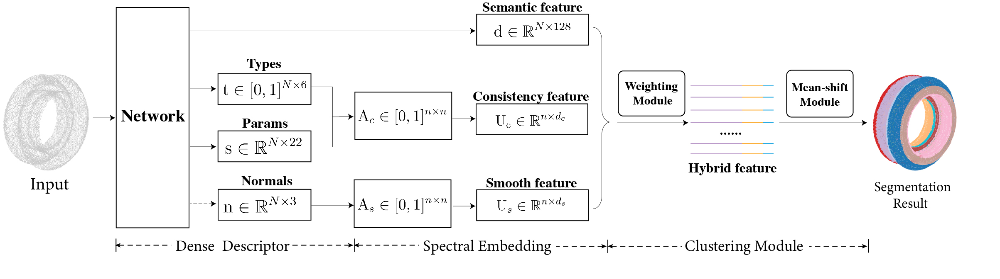

# HPNet

This repository contains the PyTorch implementation of paper: [HPNet: Deep Primitive Segmentation Using Hybrid Representations](https://arxiv.org/abs/2105.10620).

<div align="center">
  
</div>

### Installation

The main experiments are implemented on pytorch 1.7.0, tensorflow 1.15.0. Please install the dependancy packages using `pip install -r requirements.txt`.

### Dataset

#### ABCParts Dataset
ABCParts Dataset is made by [ParseNet](https://arxiv.org/abs/2003.12181). Please download our preprocessed dataset [here](https://drive.google.com/file/d/1qH-1A8p3jDtTxS2i-423AZTjiBu9RGL1/view?usp=sharing)(69G) and put it under data/ABC folder. We add primitive parameters of each object in this dataset.

We also provide the preprocessing scripts under `utils` folder. To process by yourself, please run
```
cd utils
python process_abc.py --data_path=/path/to/parsenet-codebase/data/shapes --save_path=/path/to/saved/dir
```

### Usage

To train our model on ABC dataset: run
```
python train.py --data_path=./path/to/dataset`
```

To evaluate our model on ABC dataset: run 
```
python train.py --eval --checkpoint_path=./path/to/pretrained/model --val_skip=100
```
on the subset of test dataset. To test on the full dataset, simply set `val_skip=1`.

**pretrained models**

We provide pre-trained model on ABC Dataset [here](https://drive.google.com/file/d/1fj84kyD9CGT8j61IW-xSWZ5q4q5IpoYx/view?usp=sharing). This should generate the result reported in the paper.

### Acknowledgements

We would like to thank and acknowledge referenced codes from 

1. ParseNet: https://github.com/Hippogriff/parsenet-codebase.

2. DGCNN: https://github.com/WangYueFt/dgcnn.


### Citations

If you find this repository useful in your research, please cite:

```
@article{yan2021hpnet,
  title={HPNet: Deep Primitive Segmentation Using Hybrid Representations},
  author={Yan, Siming and Yang, Zhenpei and Ma, Chongyang and Huang, Haibin and Vouga, Etienne and Huang, Qixing},
  journal={arXiv preprint arXiv:2105.10620},
  year={2021}
}
```
